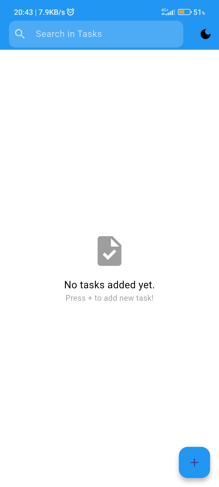
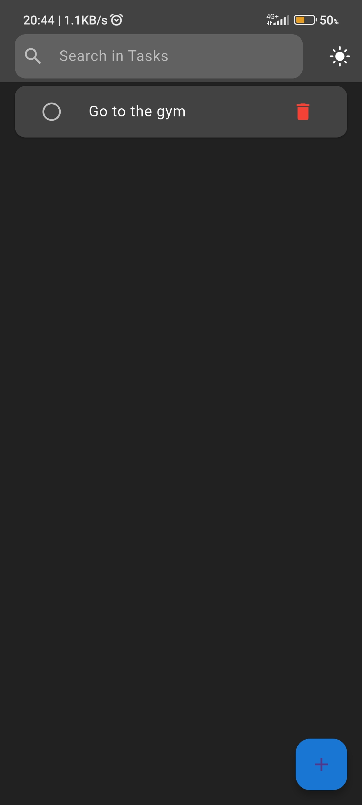

# Do it Now - Task Management App

## App Description
"Do it Now" is a comprehensive task management application with professional features and a beautiful user interface for organizing daily tasks.

## Key Features

### Core Management
- Add new tasks
- Mark tasks as completed
- Delete tasks
- Display remaining tasks count

### User Experience
- Dark/Light Mode
- Advanced task search

### Data Management
- Automatic data saving
- Task recovery on app launch
- Data persistence after app closure

## Technologies Used

### Language & Framework
- **Flutter** - Main framework
- **Dart** - Programming language

### Packages Used
- `shared_preferences` - Local storage
- `Material Design` - UI design

### Concepts Implemented
- State Management using `setState`
- Asynchronous Programming (`async/await`)
- JSON Encoding/Decoding
- Responsive UI Design

## Screenshots

<div align="center">
  
| Light Mode | Dark Mode |
|------------|-----------|
|  |  |
|  |  |
|  |  |

</div>

## How to Run

### Prerequisites
- Flutter SDK 3.0 or higher
- Android Studio or VS Code

### Installation Steps
```bash
# 1. Clone the project
git clone https://github.com/yourusername/do-it-now.git

# 2. Navigate to directory
cd do-it-now

# 3. Get dependencies
flutter pub get

# 4. Run the app
flutter run

##Project Structure

lib/
├── main.dart          # Application entry point
├── screens/           # App screens
  └── todo_screen.dart # Main screen